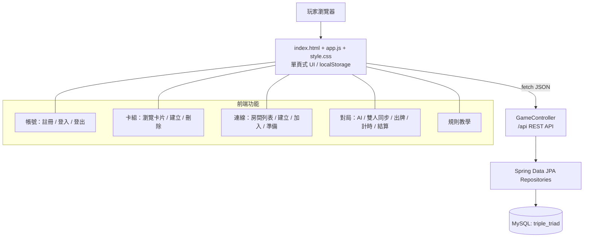
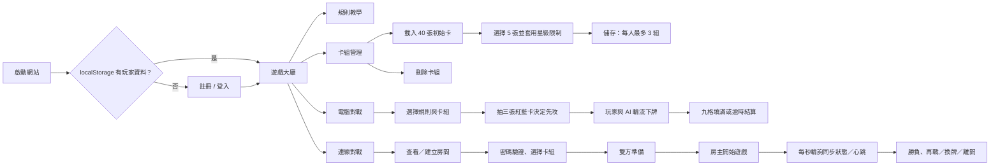
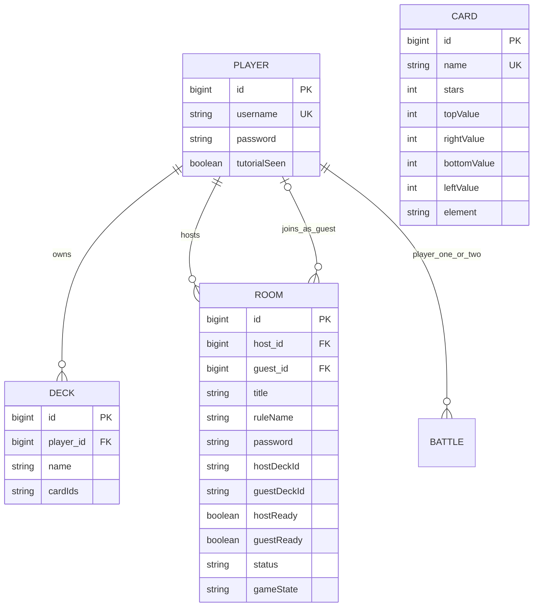
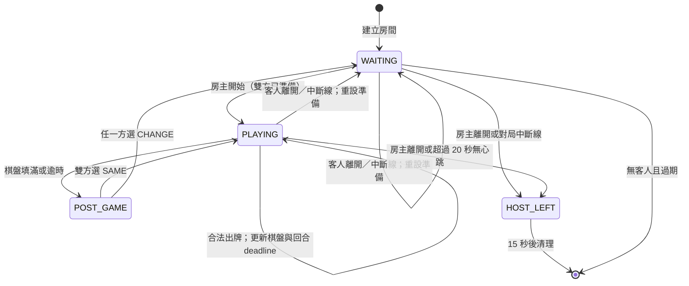
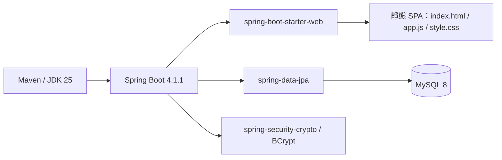

# Triple Triad｜專案功能全覽

> 盤點基準：目前工作目錄的程式碼。此文件描述「已實作且實際可呼叫」的功能；畫面上提到、但沒有完整規則引擎支援的項目會另外標示。

## 1. 系統總覽圖

## 2. 使用者功能地圖

## 3. 模組與職責

| 層級 | 檔案／元件 | 職責 |
|---|---|---|
| 啟動 | `TripleTriadApplication.java` | 啟動 Spring Boot。 |
| API | `GameController.java` | 全部 REST 端點、輸入檢核、房間生命週期、伺服器端對局狀態與逾時處理。 |
| 前端 | `static/index.html` | 載入單頁應用程式。 |
| 前端 | `static/app.js` | 畫面渲染、瀏覽器狀態、API 呼叫、AI 行動與線上對局輪詢。 |
| 前端 | `static/style.css` | 大廳、卡片、九宮格、彈窗等視覺樣式。 |
| 持久化 | `model/*.java` | `Player`、`Card`、`Deck`、`Room`、`Battle` 資料模型。 |
| 持久化 | `repo/*.java` | JPA CRUD；`PlayerRepository.findByUsername`、`DeckRepository.findByPlayerId` 為額外查詢。 |
| 資料庫 | `database/mysql-workbench-init.sql` | MySQL 資料庫與基礎表格建立。 |
| 設定 | `application.properties` | MySQL 連線、JPA 自動更新、錯誤訊息回傳。 |

## 4. 資料模型關係圖

說明：`Deck.cardIds` 是逗號分隔的卡片 ID 字串，而非與 `Card` 的關聯表。`Battle` 與 `BattleRepository` 已建立，但目前 API 對戰不會新增或讀取 battle 紀錄。

## 5. API 功能全表

所有端點前綴皆為 `/api`。

| 類別 | 方法與路徑 | 功能 |
|---|---|---|
| 驗證 | `POST /auth/register` | 驗證帳號格式、密碼 8–72 字元、帳號唯一；以 BCrypt 儲存密碼。 |
| 驗證 | `POST /auth/login` | 驗證登入；舊的非 BCrypt 密碼會在成功登入後升級雜湊。 |
| 教學 | `POST /players/{id}/tutorial-complete` | 設定玩家已看過教學。 |
| 卡片 | `GET /cards` | 取得所有卡片；首次啟動會自動建立 40 張預設卡。 |
| 卡組 | `GET /players/{id}/decks` | 取得玩家卡組。 |
| 卡組 | `POST /players/{id}/decks` | 建立卡組：剛好 5 張、不重複、卡片存在、每人最多 3 組。 |
| 卡組 | `DELETE /decks/{id}` | 刪除指定卡組。 |
| 房間 | `GET /rooms`、`GET /rooms/{id}` | 取得房間清單／詳細狀態；讀取時會清理過期房間並判定逾時。 |
| 房間 | `POST /rooms` | 建立房間：最多 10 間、回合 30–60 秒、可設四位數密碼。 |
| 房間 | `POST /rooms/{id}/password` | 在加入前檢查房間密碼與是否仍可加入。 |
| 房間 | `POST /rooms/{id}/join` | 加入等待中的房間並選定客方卡組。 |
| 房間 | `POST /rooms/{id}/deck` | 房主／客人選擇自己的卡組；已準備者不可更換。 |
| 房間 | `POST /rooms/{id}/ready` | 切換準備狀態；必須先選卡組。 |
| 對局 | `POST /rooms/{id}/start` | 僅房主可在雙方準備後開始；建立 3×3 空棋盤與先攻抽卡結果。 |
| 對局 | `POST /rooms/{id}/state` | 當前玩家提交下一個棋盤狀態；伺服器驗證回合、棋盤大小、填滿後勝負與新 deadline。 |
| 對局 | `POST /rooms/{id}/heartbeat` | 更新最後在線時間，用於偵測 20 秒未回應。 |
| 對局 | `POST /rooms/{id}/next-decision` | 對局後雙方決定：同卡組再戰、換牌或離開。 |
| 相容舊流程 | `POST /rooms/{id}/next` | 舊版單方決定下一局流程；目前前端最終版本改用 `next-decision`。 |
| 離線 | `POST /rooms/{id}/leave` | 記錄房主／客人離開；保留 15 秒離開提示。 |
| 清理 | `DELETE /rooms/{id}/host/{player}` | 僅房主可刪除指定房間。 |
| 清理 | `DELETE /rooms/host/{id}` | 登出時刪除該玩家主持的所有房間。 |
| AI | `POST /battle/ai` | 回傳 AI 對局初始化資訊（ID、規則、60 秒、對手名稱）。 |

## 6. 線上房間／對局狀態圖

## 7. 對戰規則：實際行為

| 功能 | 實作位置 | 目前狀態 |
|---|---|---|
| 3×3 棋盤、每人 5 張牌、填滿計分 | 前端 `launch` / `place` / `end`，線上狀態由 API 保存 | 已實作。 |
| 先攻抽籤 | API 線上 `newGame`；前端 AI `launch` | 已實作；三張紅／藍卡，多數方先攻。 |
| 基本翻牌 | 前端 `flip` | 已實作：新卡數值大於相鄰敵卡對應邊時翻轉。 |
| 逆轉（Reverse） | 前端 `flip` | 已實作：比較改為小於。 |
| 回合計時 | API 線上 `deadlineEpochMs` + `timeout`；前端 AI 計時器 | 已實作。 |
| AI | 前端 `aiMove` | 已實作為隨機空格、依序取未用牌的簡易 AI。 |
| Plus、Same、Combo | 教學／選項／房間規則名稱 | **未在 `flip` 或伺服器規則引擎中實作**；目前選取 Plus／Same 不會套用加算、同數或連鎖翻牌。 |

## 8. 重要限制與維護注意事項

- `app.js` 有多次同名函式宣告；JavaScript 會採用最後一次宣告，例如 `online`、`roomForm`、`join`、`onlineNext`。較早版本雖仍在檔案中，但不會生效。
- 線上對戰由客戶端計算翻牌後，將完整棋盤送往 `POST /rooms/{id}/state`；伺服器只驗證參與者、回合、棋盤長度與結算，沒有重算翻牌合法性。
- API 使用請求中的 `playerId` 來辨識玩家，沒有 session、JWT 或 Spring Security 的 HTTP 認證／授權機制；因此不適合直接暴露到不受信任的公開網路。
- 房間密碼以原值寫入 `rooms.password`；若需要正式使用，應改為雜湊保存。
- 前端有「五星／四星」卡組限制，但後端建立卡組只驗證 5 張不重複卡，沒有執行同一份星級限制；可直接呼叫 API 繞過前端規則。
- README 與部分 UI 文案有字元編碼異常；建議確認檔案均以 UTF-8 儲存。

## 9. 啟動與依賴

預設服務位置為 `http://localhost:8080`；資料庫連線透過 `DB_URL`、`DB_USERNAME`、`DB_PASSWORD` 等環境變數覆寫設定檔預設值。
